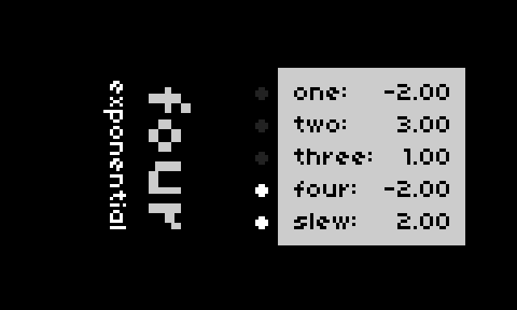

# vcr

a simple Voltage Collection and Recall script for norns + grid + crow

## norns

#### keys
  1. alt
  2. navigate to previous voltage set
  3. navigate to next voltage set

#### encoders
  1. set voltage 1 for the current voltage set
  2. set voltage 2 for the current voltage set
  3. set voltage 3 for the current voltage set

holding alt will shift focus to a second set of parameters:

  1. **(+ alt)** set slew shape/style for the current voltage set
  2. **(+ alt)** set voltage 4 for the current voltage set
  3. **(+ alt)** set slew time for the current voltage set

## grid

the grid controls which voltage set gets sent to crow.
it does not matter *where* you press, just how many keys were pressed at once. 

i.e. pressing 1 key will recall voltage set 1, while pressing 8 keys will recall voltage set 8. 

voltage sets are sent to crow on release of the grid keys.

*n.b. - pressing 10 keys at once will set the crow outputs to 0 volts*

## crow

crow outputs 1-4 will carry voltages 1-4 from your voltage sets.

-----------

## slew shapes/styles

* 'linear'
* 'sine'
* 'logarithmic'
* 'exponential'
* 'now': ignore slew time, go instantly to the destination then wait
* 'wait': wait at the current level, then go to the destination
* 'over': move toward the destination and overshoot, before landing
* 'under': move away from the destination, then smoothly ramp up
* 'rebound': emulate a bouncing ball toward the destination

